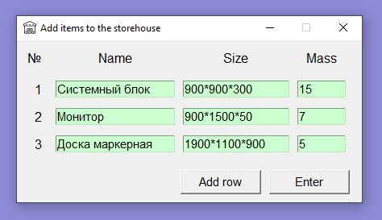
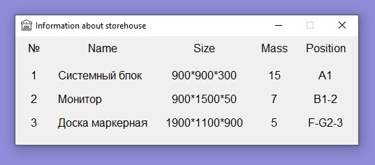
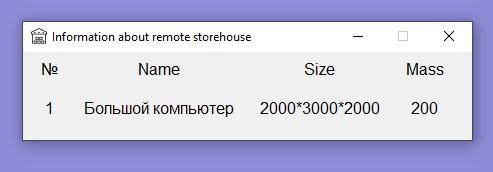

# Электронный склад

[Московская предпрофессиональная олимпиада школьников.](http://predprof.olimpiada.ru/)

[Профиль "Информационные технологии".](http://predprof.olimpiada.ru/it)

**Командный кейс №5 "Электронный склад".**
[Исходный текст технического задания](docs/technical-requirements.pdf)

## Навигация

* [Описание проекта](#chapter-0)
* [Как начать](#chapter-1)
* [Интерфейс приложения](#chapter-2)
* [Ошибки](#chapter-3)
* [Код](#chapter-4)
* [Авторы](#chapter-5)
* [Лицензия](#chapter-6)

<a id="chapter-0"></a>

## Описание проекта

Информационный сервис обеспечивающий взаимодействие пользователей (операторов) с автоматизированным складом.

[Техническая документация](docs/technical-documentation.pdf)

### Функциональность

1. Добавление нескольких позиций из поставки на склад.
2. Отображение в виде списка позиций (товаров), с указанием ячейки, в которой товар находится на складе (по запросу в
   пользовательском интерфейсе).

3. Выбор определенного товара (позиции), для осуществления выдачи его аппаратной частью.
4. Наличие удалённого склада для позиций, которые невозможно разместить на основном складе.
5. Отображение в виде списка позиций (товаров), находящихся на удалённом складе.

<a id="chapter-1"></a>

## :hammer: Как начать

1. Установить [Python 3](https://www.python.org/downloads/)
2. Скачать данный репозиторий
    * Вариант 1
        1. Установить [Git](https://git-scm.com/download/win)
        2. Клонировать репозиторий
       ```bash
       git clone https://github.com/W-A-L-L-3/electronic-storehouse
       cd electronic-storehouse
       ```
    * Вариант 2 - [Скачать ZIP](https://github.com/W-A-L-L-3/electronic-storehouse/archive/main.zip)

4. Запустить `./API/app.py`
5. Запустить `./main.py`

<a id="chapter-2"></a>

## Интерфейс приложения

### Главное окно

#### До инициализации склада


**1** - Инициализация склада.

Уведомление об успешной инициализации склада:


#### После инициализации склада


**2** - Добавление нескольких позиций из поставки на склад.

**3** - Отображение в виде списка позиций (товаров), с указанием ячейки, в которой товар находится на складе.

**4** - Выбор определенного товара (позиции), для осуществления выдачи его аппаратной частью.

**5** - Отображение в виде списка позиций (товаров), находящихся на удалённом складе.

### Окно для добавления товаров на склад


**1** - Добавить строчку для ещё одного товара.

**2** - Отправить все товары на склад.

После двух нажатий кнопки **1**:


_Корректный_ ввод позиций:



+ Название - непустая строка
+ Размеры - 3 натуральных числа, разделённых "\*" (длина\*ширина\*высота)
+ Масса - натуральное число

_Некорректный_ ввод позиций:


Уведомление об успешной отправке товаров на склад:


### Окно для отображения позиций (товаров), находящихся на складе



### Окно для выбора определенного товара (позиции), для осуществления выдачи его аппаратной частью.


При успешном выборе и выдаче товара появится всплывающие уведомление:


### Окно для отображения позиций (товаров), находящихся на удалённом складе



<a id="chapter-3"></a>

## :heavy_exclamation_mark: Ошибки

### Ошибка получения параметров при инициализации


**Возможные причины:**

1. Не запущено API (см. пункт 4 раздела [Как начать](#chapter-1)).
2. Какая-либо ошибка связи с API.

### Некорректное значение в каком-либо из полей в поставке


### Товар не найден


**Причина:**

Товара с введённым названием нет на складе.

<a id="chapter-4"></a>

## Код

### Папки

+ **API** - исходный код программной модели аппаратной части (взят
  с [ppo_it_5_2021](https://dt.miet.ru/gitlab/dt_smartpark/ppo_it_5_2021))
+ **server** - серверная часть приложения (моделирование работы склада, обращение к API)
+ **gui** - клиентская часть приложения (графический интрефейс)

### Используемые библиотеки

* [tkinter](https://docs.python.org/3/library/tkinter.html) - графический интерфейс приложения
* [json](https://docs.python.org/3/library/json.html) - работа с форматом json
* [uuid](https://docs.python.org/3/library/uuid.html) - генерация случайного идентификатора товара
* [pickle](https://docs.python.org/3/library/pickle.html) - хранение объекта модели склада в бинарном режиме

<a id="chapter-5"></a>

## :smile: Авторы
<a href="https://github.com/Yu-Leo">
    
</a>
<a href="https://github.com/kholevenkovav">
    
</a>
<a href="https://github.com/ASDF2357">
    
</a> 

<a id="chapter-6"></a>

## :open_hands: Лицензия

GNU General Public License v3.0.

Полный текст в [LICENSE](LICENSE)
